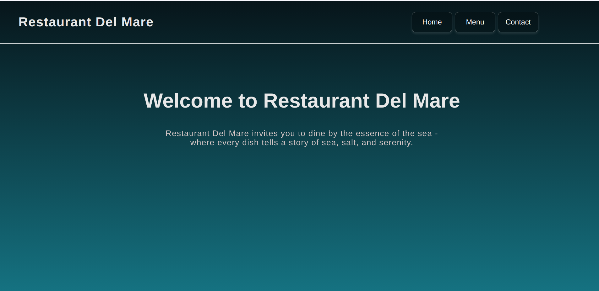
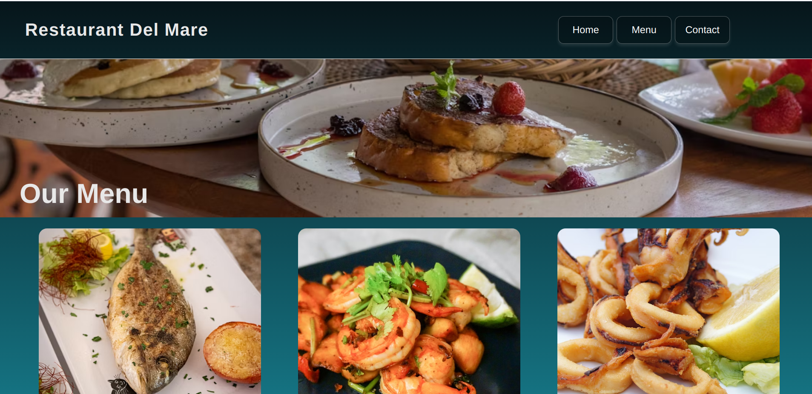
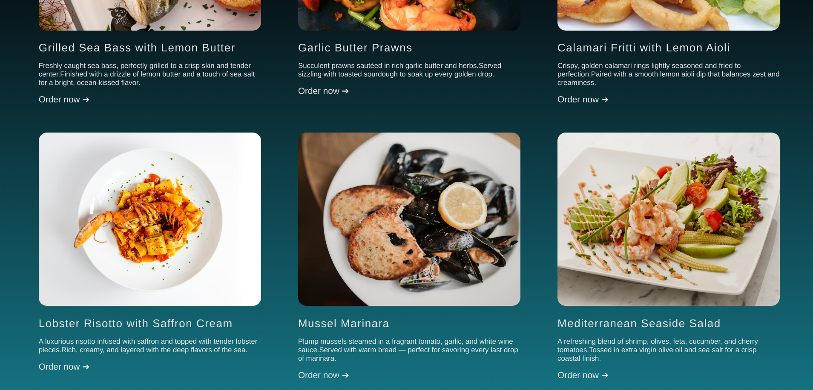
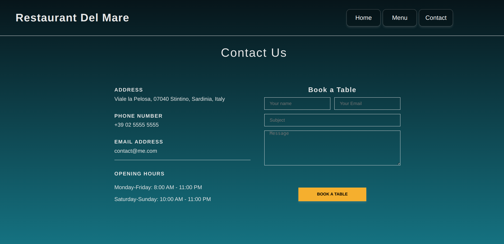

### **Restaurant Page**

---

### **Description**

Ristorante Del Mare is a coastal-themed Italian restaurant website inspired by Mediterranean seaside dining.
The website features multiple dynamic pages — Home, Menu, Contact, and Reservations — all rendered using JavaScript DOM manipulation instead of static HTML.

This project focuses on building UI content entirely through **ES6 modules** and **Webpack**, demonstrating clean code structure and modular front-end architecture.

---

### **Features**

* Fully modularized JavaScript with ES6 import / export
* Webpack bundling & asset management
* Smooth fade-in page transitions
* Multi-page navigation simulated through dynamic DOM rendering

---

### **Live Demo**

👉 **View Demo:** *https://rig135.github.io/Restaurant-Page/*

---

### **Screenshots**

---

### **About the Project**

This project was developed as part of **The Odin Project** JavaScript curriculum.
The goal was to practice:

* Modular JavaScript development
* DOM generation via JS instead of HTML
* Webpack configuration & builds
* Clean UI layout and theme consistency

**Theme Inspiration:**
Ristorante Del Mare draws inspiration from calm coastal towns of Southern Italy, where the sea, food, and atmosphere blend into one serene experience.

---

### **Attributions**

#### **Images**

All dish and environment photographs are sourced from **Unsplash**, royalty-free and free for commercial use.

#### **Icons**

GitHub Logo & UI icons by **Font Awesome**
[https://fontawesome.com](https://fontawesome.com)

